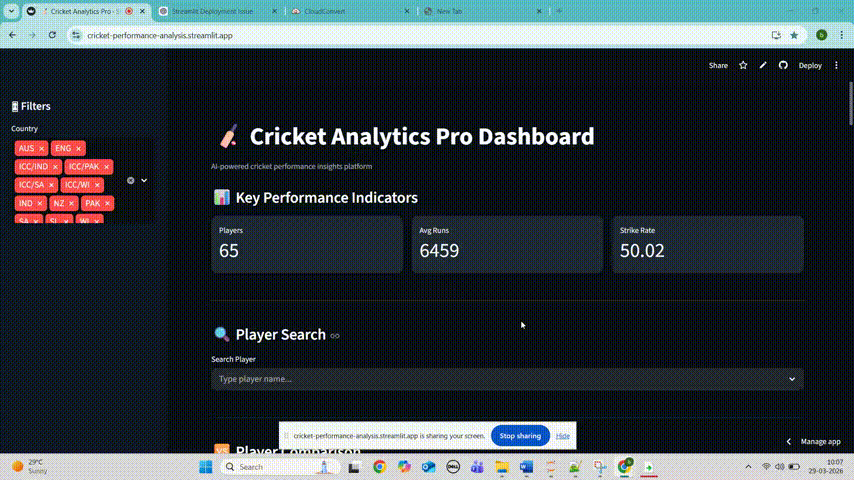

# 👩‍💻 Beesam Gayathri – Data Science Portfolio

Aspiring Data Scientist and Machine Learning Enthusiast with hands-on experience in building end-to-end AI/ML and Data Analytics projects — from data preprocessing to model training and deployment.

---

## 🚀 About Me

I am passionate about **Data Science, Machine Learning, and NLP**, with practical experience in:

- Data Cleaning & Preprocessing  
- Exploratory Data Analysis (EDA)  
- Machine Learning Model Development  
- Data Visualization  
- Web App Deployment using Streamlit  

I am actively looking for **entry-level Data Scientist / ML Engineer roles**.

---

## 🛠️ Technical Skills

- **Programming:** Python, SQL  
- **Data Analysis:** Pandas, NumPy  
- **Machine Learning:** Scikit-learn, Supervised Learning, Feature Engineering  
- **Visualization:** Matplotlib, Seaborn  
- **Deployment:** Streamlit  
- **Version Control:** Git, GitHub  

---

# 📂 Projects

---

## 🏏 Cricket Performance Analysis Dashboard (EDA Project)

### 🌐 Live App
https://cricket-performance-analysis.streamlit.app/

---

### 🎯 Project Overview

An interactive **data analytics dashboard** built to analyze cricket player performance using real-world data.  
The project focuses on converting raw data into meaningful insights using EDA techniques.

---

### ✨ Features

- Interactive dashboard UI  
- Player search functionality  
- Country-based filtering  
- Key performance metrics:
  - 🏏 Total Runs  
  - 📊 Batting Average  
  - ⚡ Strike Rate  

---

### 📊 Key Insights

- Identify top-performing players  
- Compare performance across countries  
- Analyze aggressive vs consistent players  
- Discover batting performance trends  

---

### 🛠️ Tech Stack

- Python  
- Pandas, NumPy  
- Matplotlib, Seaborn  
- Streamlit  

---
## 🎥 App Demo  

  

  🏏 Interactive Cricket Data Analysis Dashboard

### 🔮 Future Enhancements

- Player vs Player comparison  
- Machine Learning predictions  
- Dark mode UI  
- Export/download reports  

---

## 📰 Fake News Detection (NLP Project)

### 🌐 Live App
https://fake-news-detection-genai-affemcburdaahsrthtucvy.streamlit.app/

---

### 🎯 Project Overview

A Machine Learning and NLP-based classification system that predicts whether a news article is **Real or Fake**.

---
## 🎥 App Demo  

  

### ✨ Features

- Text preprocessing & cleaning  
- TF-IDF feature extraction  
- Logistic Regression model  
- Streamlit web deployment  

---

### 🛠️ Tech Stack

- Python  
- Pandas, Scikit-learn  
- NLP (TF-IDF)  
- Streamlit  

---

## 📫 Contact

- **GitHub:** https://github.com/BeesamGayathri  
- **LinkedIn:** https://linkedin.com/in/beesam-gayathri  

---

## ⭐ Final Note

This portfolio is continuously evolving as I build more real-world projects and strengthen my skills in Data Science, Machine Learning, and AI.
